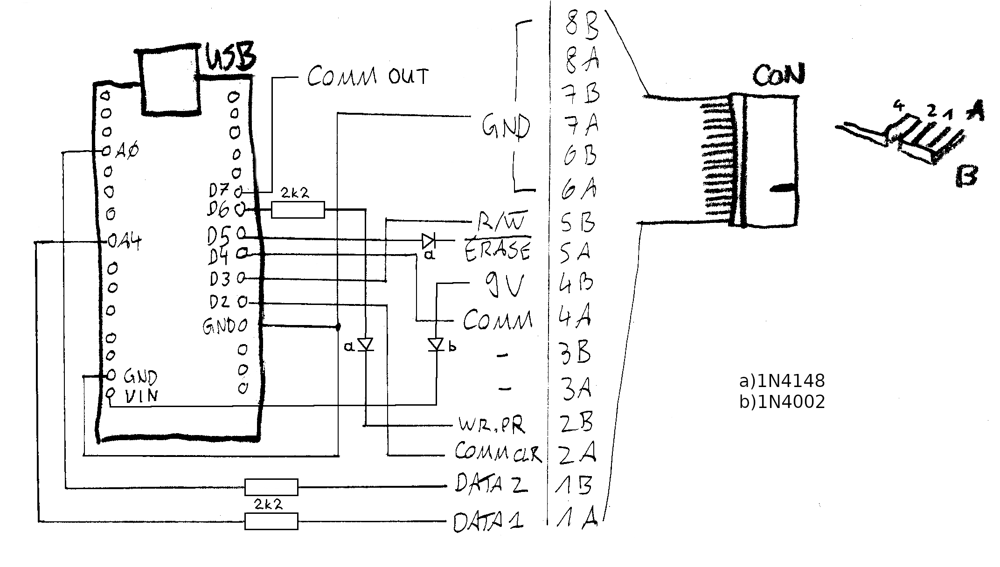

# OqtaDrive

#### *Sinclair Microdrive* emulator for *Spectrum* & *QL*

## TL;DR
*OqtaDrive* emulates a bank of up to 8 *Microdrives* for use with a *Sinclair Spectrum* or *QL* machine. It's built around an *Arduino Nano* that connects via its GPIO ports to the *Microdrive* interface and via USB to a daemon running on a PC. The same *Nano* can be used with both *Spectrum* and *QL*, without any reconfiguration. While the *Nano* is essentially a low-level protocol converter, the daemon takes care of storing and managing the *cartridges*. It additionally exposes a local HTTP API endpoint. A few shell commands are provided that use this API and let you control the daemon, e.g. load and save cartridges into/from the virtual drives.

## Features
- Supports all *Microdrive* operations on *Spectrum* with *Interface 1* and on *QL*, no modifications or additional software required
- Daemon can run on *Linux*, *MacOS*, and *Windows* (community testing for the latter two needed!)
- Load & save from/to *MDR* and *MDV* formatted cartridge files
- For *Spectrum*, *Z80* snapshot files can be directly loaded (requires *Z80onMDR*)
- List virtual drives & contents of cartridges
- Hex dump cartridge contents for inspection

Here's a short [demo video](https://www.babbletower.net/forums/spectrum/microdrive/oqtadrive-demo.mp4) showing *OqtaDrive* & a *Spectrum* in action, doing a *Microdrive* test with the original *Sinclair* demo cartridge image, and a cartridge format.

## Status
*OqtaDrive* is currently in *alpha* stage, and under active development. Things may still get reworked quite considerably, which may introduce breaking changes.

## Motivation
Why another *Microdrive* emulator? There are a few options out there already, but as far as I could see those are stand-alone solutions that use some form of media, usually an SD card to store the cartridges. So for one thing you have to go back and forth between the drive and your PC to upload new cartridge images or make backup copies. Additionally, almost by definition these standalone drives provide only a limited user interface for managing cartridges or require some form of control software running on the *Spectrum* or *QL* to do that. Still, they are great solutions, in particular if you want an authentic setup with no modern machines nearby.

My use case is different though. Whenever I use my *Spectrum* or *QL*, it's in combination with my PC, which is running a video grabber. I also use my [spectratur](https://github.com/xelalexv/spectratur) project to do keyboard input directly from the PC. So I started thinking whether it wouldn't be possible to just stream the *Microdrive* data back and forth between *Spectrum*/*QL* and PC, and do all the management there. This would also open up interesting options, such as dynamically changing cartridge contents. Overall, however the goal is to create a *faithful* reproduction of the original. That is, on the *Spectrum*/*QL* side, operating the emulated *Microdrives* should feel exactly the same as using the real thing.

## Hardware

### Circuit

The circuit is straightforward. You only need to connect a few of the *Nano*'s GPIO pins to an edge connector plug, program `arduino/oqtadrive.ino` onto the board, and you're all set. Note however that on the *QL*, the edge connector is upside down, just something to keep in mind when designing a case for the adapter, so that it works with both machines. It may also be advisable to place resistors in series into the data lines (`DATA1` and `DATA2`), around 2.2kOhm. This would limit the current that can flow should there ever be bus contention due to the adapter misbehaving. So if you really want to make sure there's no risk of damaging your vintage machine, use the resistors! I haven't tried this myself, so feedback would be welcome.

You may also connect two LEDs for indicating read & write activity to pins `D12` and `D11`, respectively (don't forget resistors). By default, the LEDs are on during idle and start blinking during activity. If you want them to be off during idle, set `LED_RW_IDLE_ON` to `false` in `oqtadrive.ino`.

### Configuration
The adapter recognizes what it's plugged in to, i.e. *Interface 1* or *QL*. But it's also possible to force a particular machine. Have a look at the top of `oqtadrive.ino`. There are a few more settings that can be changed, but there shouldn't really be a need to do that.

*Hint*: After turning on the *Spectrum*, the adapter sometimes erroneously detects the *Interface 1* as a *QL*. In that case, run `CAT 1` on the *Spectrum* and reset the adapter afterwards. That should fix the problem.

### Using a Different *Arduino* Board
I haven't tried this out on anything other than a *Nano*. It may work on other *Arduino* boards, but only if they use the same micro-controller running at the same clock speed. There are timing-sensitive sections in the code that would otherwise require tweaking. Also, stick to the GPIO pin assignments, the code relies on this.

## Running
There's a single binary `oqtactl`, that takes care of everything that needs to be done on the PC side. This can run the daemon as well as several control actions. Just run `oqtactl -h` to get a list of the available actions, and `oqtactl {action} -h` for finding out more about a particular action. There are cross-compiled binaries for *MacOS* and *Windows* in the *release* section of this project for every release. However, I don't know whether they actually work, so feedback is welcome.

### Daemon
Start the daemon with `oqtactl serve -d {serial device}`. It will look for the adapter at the specified serial port, and keep retrying if it's not yet present. You can also dis- and re-connect the adapter. The daemon should re-sync after a few seconds.

Daemon logging behavior can be changed with these environment variables:

| variable     | function   | values                                            |
|--------------|------------|---------------------------------------------------|
| `LOG_LEVEL`  | log level; defaults to `info` | `fatal`, `error`, `warn`, `info`, `debug`, `trace`|
| `LOG_FORMAT` | log format; gets automatically switched to *JSON* when running without a TTY | `json` to force *JSON* log format, `text` to force text output |
| `LOG_FORCE_COLORS` | force colored log messages when running with a TTY | `true`, `false` |
| `LOG_METHODS` | include method names in log messages | `true`, `false` |

### Control Actions
The daemon also serves an HTTP control API on port `8888` (can be changed with `-p` option). This is the integration point for any tooling that may evolve in the future, e.g. a browser-based GUI. It is also used by the provided command line actions. The most important ones are:

- load cartridge: `oqtactl load -d {drive} -i {file}`
- save cartridge: `oqtactl save -d {drive} -o {file}`
- list drives: `oqtactl ls`
- list cartridge content: `oqtactl ls -d {drive}` or `oqtactl ls -i {file}`

`load` & `save` currently support `.mdr` and `.mdv` formatted files. I've only tested loading a very limited number of cartridge files available out there though, so there may be surprises. If you have [*Z80onMDR*](https://www.tomdalby.com/other/z80onmdr.html) installed on your system and added to `PATH`, `load` can load *Spectrum Z80* snapshot files into the daemon, converting them to *MDR* on the fly by calling *Z80onMDR*.

## Caveats & Current Limitations

- Drive offset detection is only available for the *QL*, but may not always work reliably. It's possible to set a fixed value, i.e. `2` if the two internal drives on the *QL* are present. Have a look at the top of `oqtadrive.ino`. I haven't tried yet to bypass the internal drives on a *QL*, so I'd love to hear how that goes. For the *Spectrum* the offset defaults to `0`. If you want to use an actual *Microdrive* between *Interface 1* and the adapter, you need to set that. 

- The daemon currently keeps the cartridges in RAM only. If it is stopped, any changed cartridges that have not been saved yet will be lost. I'm planning to implement automatic persistence to disk later on.

- I haven't done a lot of testing yet.

## Building
On *Linux* you can use the `Makefile` to build `oqtactl`, the *OqtaDrive* binary. Note that for consistency, building is done inside a *Golang* build container, so you will need *Docker* to build, but no other dependencies. Just run `make build`. You can also cross-compile for *MacOS* and *Windows*. Run `CROSS=y make build` in that case. If you want to build on *MacOS* or *Windows* directly, you would have to install the *Golang* SDK there and run the proper `go build` command manually. 

## Resources
- [Spectrum Microdrive Book](https://worldofspectrum.org/archive/books/spectrum-microdrive-book) by Ian Logan
- [QL Advanced User Guide](https://worldofspectrum.org/archive/books/ql-advanced-user-guide) by Adrian Dickens
